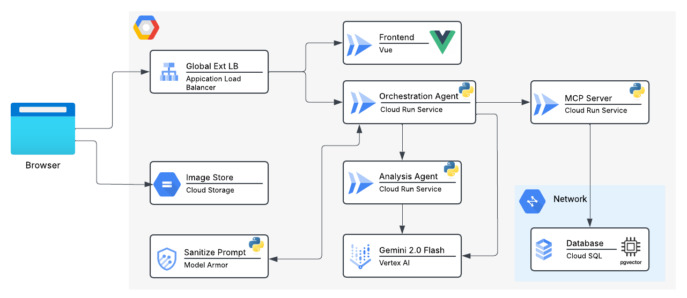

# Movie Guru ADK

This repository contains the source code for the Movie Guru, an AI-powered movie recommendation chatbot written in ADK.

The project is structured as a monorepo containing three main components: a chatbot frontend, a backend agent, and a supporting tools service.

## Architecture

The application is composed of the following core components:



* **`movie-chatbot/`** (Frontend): A web-based frontend built with Vue.js that provides the user interface for interacting with the chatbot.
* **`movie-guru-agent/`** (Orchestration Agent): The core backend agent responsible for processing user messages, understanding intent, and providing movie recommendations. It is built in Python and designed as a multi-agent system with sub-agents for conversation analysis, movie recommendations, and user profile management.
* **`movie-guru-tools/`** (MCP Server): A set of supporting tools and services, also built in Python, that likely provide APIs or utilities consumed by the main agent.
* **`a2atest/`**: An ADK-based agent-to-agent (A2A) client used to test A2A-enabled agents.
* **`movie-guru-loadgen/`**: A Go-based load generation tool that constantly sends requests to the `movie-guru-agent` server for performance testing.
* **`ollama/`**: Contains deployment configurations for running local models like `gemma3:4b` via Ollama for local development and execution.
* **`movie-guru-ax-subagent/`** (Analysis Agent): An ADK-based A2A sub-agent that analyzes conversation sentiment to generate a customer satisfaction metric.

## Technology Stack

* **Frontend**: Vue.js, Vite
* **Backend**: Python
* **Infrastructure & Deployment**: Cloud Run

## Repository Structure

```sh
.
├── movie-chatbot/      # Vue.js frontend for the chatbot UI
├── a2atest/            # ADK-based A2A test client
├── movie-guru-agent/   # Core Python backend agent and sub-agents
│   ├── app/            # Main application logic
│   ├── deployment/     # GCP deployment scripts (Terraform, Cloud Deploy)
│   └── ...
├── movie-guru-ax-subagent/ # A2A sub-agent for conversation analysis
├── movie-guru-loadgen/ # Go-based load generation server
└── movie-guru-tools/   # Supporting Python services
    ├── app/            # Main application logic
    └── deployment/     # GCP deployment scripts
├── ollama/             # Ollama deployment for local models
```

## Getting Started

To get the full application running, you will need to set up each component individually. Please refer to the `README.md` file within each component's directory for specific setup and development instructions.

* [movie-chatbot/README.md](./movie-chatbot/README.md)
* [movie-guru-agent/README.md](./movie-guru-agent/README.md)
* [movie-guru-tools/README.md](./movie-guru-tools/README.md)
* [a2atest/README.md](./a2atest/README.md)
* [movie-guru-loadgen/README.md](./movie-guru-loadgen/README.md)
* [ollama/README.md](./ollama/README.md)
* [movie-guru-ax-subagent/README.md](./movie-guru-ax-subagent/README.md)

## Deployment

The application is designed to be deployed on Google Cloud Platform. The `movie-guru-agent/deployment` directory contains Terraform scripts for provisioning the necessary infrastructure (e.g., Cloud Run, GCS, Artifact Registry) and Cloud Deploy YAML files for orchestrating deployments.

## Contributing

Please see [CONTRIBUTING.md](./CONTRIBUTING.md) for details on how to contribute to this project.

## License

This project is licensed under the terms of the [LICENSE.txt](./LICENSE.txt) file.
